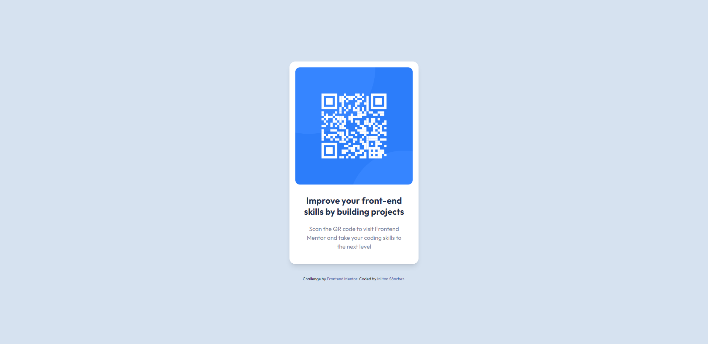

# Frontend Mentor - QR code component solution

This is a solution to the [QR code component challenge on Frontend Mentor](https://www.frontendmentor.io/challenges/qr-code-component-iux_sIO_H). Frontend Mentor challenges help you improve your coding skills by building realistic projects. 

## Table of contents

- [Overview](#overview)
  - [Screenshot](#screenshot)
  - [Links](#links)
- [My process](#my-process)
  - [Built with](#built-with)
  - [Continued development](#continued-development)
- [Author](#author)

## Overview

### Screenshot

### Links

- Solution URL: [qr-code-component solution](https://www.frontendmentor.io/solutions/responsive-page-using-flexbox-Rkj2-AqIHs)
- Live Site URL: [sanchezmilton.github.io/qr-code-component/](https://sanchezmilton.github.io/qr-code-component/)

## My process

### Built with

- HTML5 semantic markup
- CSS custom properties
- Flexbox
- Tailwindcss

### Continued development

This is more of an overview of basic HTML and CSS, but I'd like to go deeper into improving the order and style of my web apps. Later I will investigate more about tools for CSS.

**Update**: I remade the challenge using Tailwindcss and the process was quite fast compared to using only css. I will keep practicing and adapting to this framework!

## Author

- Website - [Milton Sánchez](https://www.sanchezmilton.github.io)
- Frontend Mentor - [@sanchezmilton](https://www.frontendmentor.io/profile/sanchezmilton)
- Twitter - [@sanchezgmilton](https://www.twitter.com/sanchezgmilton)
